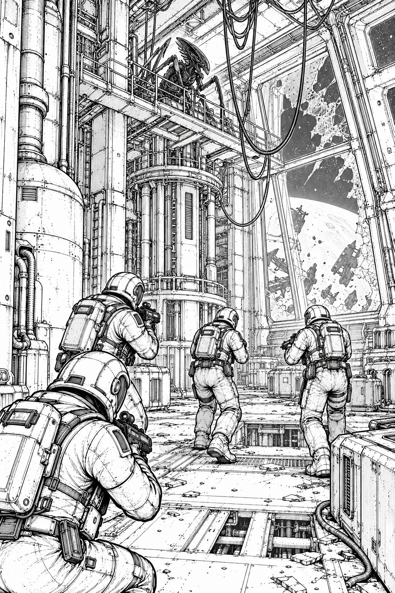

# Simple Hulk - FLUFF



Eight expeditions into the wreck.

<!-- pagebreak -->

Setting, optional rules, and eight expeditions beyond the starting mission.
Use the RULES book for all core actions. No optional rule applies unless both
players agree before setup, or a scenario explicitly includes it.


## The wreck that answered

The salvage registry calls it the *Mercy of Tides*. Its owners stopped answering
ninety years ago. Since then, drifting cargo modules have struck its hull and
stayed attached. Freight haulers, mining rigs, and a passenger observatory now
form a single slowly rotating wreck.

Yesterday, its rescue beacon transmitted a list of five names.

They were the names of your boarding team.

Marines are trained for broken gravity, shipboard fires, and people who want to
keep a door closed. Their armor is practical, scratched, and too wide for the
service passages. Each suit carries a lamp, a recorder, and enough breathable air
to make a bad decision feel reasonable.

The bugs have no recorded name. Some crew logs call them passengers. Others call
them the repair staff. The last log is an hour of someone politely asking a wall
to stop breathing.

The boarding order is simple: wake the main beacon, transmit the wreck's location,
and let the salvage fleet decide whether anything here deserves saving.

## Five people, five different kinds of noise

Use these characters if you like, or name your own. Their personalities add no
bonuses to the rules.

**Vale, boarding rifle:** Counts doors aloud. Claims it is a navigation habit.
Everyone knows it began after a door closed on the wrong side of the squad.

**Iona, scattergun:** Worked security on crowded ferries. Still tells whatever
comes around the corner to keep its hands visible.

**Kes, rotary cannon:** Writes the ammunition count on the back of one glove.
The suit has a working display. Kes trusts the glove.

**Rook, flame projector:** Knows how a ship sounds when its ventilation is healthy.
Has been very quiet since boarding.

**Sen, boarding rifle:** The team's engineer. Reads damage reports as though the
ship is answering questions. Keeps a second rifle trained on the route home.

Before a mission, give each Marine one ordinary reason to get home: an unfinished
meal, a borrowed coat, a message that deserves an answer. When a Marine falls,
turn its counter over and keep the name in the mission log.

## What the contacts might mean

A blip is a moving return on the squad's local scanner. A crowded corridor can
produce one clear signal. A lone bug dragging metal can sound like a crowd.
The basic rules keep every blip dangerous; the ghost-contact house rule adds
uncertainty about whether anything is there at all.

Basic aliens are lean climbing animals forced onto the deck by the game's square
grid. They use the walls in the fiction, but cannot bypass walls or models in play.
Their greatest weapon is the distance between a Marine's last shot and its next
opportunity to clear a jam.

Skitters may be young bugs, hungry enough to move too quickly for their own safety.
Brutes could be older animals or hosts swollen around layers of embedded machinery.
Spitters coat corridors with a bitter fluid that eats through suit seals.
These are possibilities for the crew's reports, not established scientific facts.

Nothing here requires an evil mastermind. A nest can be terrifying simply because
it has been disturbed, and the only route out passes through the people who did it.


<!-- pagebreak -->

## A worked exchange: the door at the end

This is a small practice position, independent of the beacon mission. North is up.
`R` is a north-facing rifle Marine, `b` a hidden strength-2 blip, and `+` a closed
door. All other rules are the basic rules.

```text
#####
#.b.#
##+##
##.##
##R##
#####
```

The Marine has spent 2 AP entering overwatch and ended its activation. The door
blocks sight to the blip.

1. The blip spends 1 of its 6 AP opening the adjacent door. Opening finishes
   before reactions. The Marine can now see the blip, so it reveals.
2. The alien player places one alien on the former blip square and the other on
   the floor immediately to its left. The first is nominated to continue the
   activation; each has 5 AP remaining for this phase.
3. The rifle reacts against the acting alien, at range 3. A roll of 2 and 4 misses.
   The second alien receives no separate shot just for being placed.
4. The acting alien spends 1 AP moving onto the open door square. The rifle reacts
   again, rolling 1 and 5. The entire shot fails; the rifle jams and loses overwatch.
5. The alien spends 1 AP moving down to the square immediately north of the Marine,
   then 1 AP attacking. No overwatch remains. The alien rolls 3, adds 2, and scores
   5. The Marine rolls 4 with no bonus and loses one wound.
6. The alien attacks again for 1 AP. It rolls 2 + 2 = 4; the Marine rolls 6. The
   alien loses its only wound and is removed. Its unused AP disappear.
7. The other alien can still activate with its inherited 5 AP. It must move around
   the corner onto the central column; it cannot attack diagonally or pass through
   another model.

Next Marine phase, the wounded rifle Marine could clear the jam for 1 AP, fire
for 1 AP, then spend 2 AP on overwatch if it survives and the player wants to hold
position. Moving instead might save it, but the open door now gives the bugs a
short route to the squad.


<!-- pagebreak -->

## Optional rules: strange life aboard

Start with basic aliens, then add one option at a time. Agree on changes before
setup. Unless a scenario says otherwise, replace only one strength-1 blip with
one specialist, keep its identity secret, and reveal it when the contact reveals.
The replacement uses that blip's pool slot; it adds no extra arrival.

### Optional bug varieties

When using variants, privately replace **one** of the strength-1 blips with a
single specialist. Reveal its type with the blip. Do not add specialists on top
of the normal blip strength. All unlisted rules remain those of a basic alien.

| Bug | AP | Wounds | Melee bonus | Special rule |
|---|---:|---:|---:|---|
| Skitter | 8 | 1 | +1 | Speed only; normal movement and reactions |
| Brute | 4 | 3 | +3 | Takes 2 AP to operate a door |
| Spitter | 5 | 1 | +0 | 2 AP: ranged attack, range 4, 1d6 hits on 4+ |

A spitter has all-direction shooting, normal sight blocking, and unlimited
ammunition. Its shot triggers eligible overwatch **after AP is spent but before
it rolls**, like a melee declaration. If it survives, it fires. If the target has
been removed, the shot is lost. An actively revealing specialist inherits remaining
blip AP capped at its own maximum; an unactivated specialist uses its listed AP.
A finished blip remains finished. Apply stun normally.


<!-- pagebreak -->

## House rules and construction kit

These are optional, not part of the starting mission. Rematch with switched teams
before judging a change. Scenarios are ready to play but still need table testing
for balance; the suggested adjustments below are deliberately small.

### Other house rules


- **Training drill:** Extend the mission deadline by two Marine phases;
  keep all deployment timings unchanged. Good for a first learning game.
- **Hard vacuum:** Marines have 1 wound instead of 2. Expect much shorter lives.
- **Supply cache:** Once per mission, the cannon Marine may spend 2 AP on a mission console to
  gain 4 ammunition marks without taking an objective action.
- **Ghost contacts:** Add one strength-0 blip at alien phase 3, queued behind any
  normal arrival. It moves normally, cannot attack, and disappears when revealed.
- **Reliable bursts:** An overwatch attack jams only if at least two dice show 1. This helps the Marines.
- **Sealed bulkheads:** Any model may attack an adjacent closed door for 2 AP.
  Roll a d6; on 5+ replace it with open floor permanently. This is a non-attack
  action for overwatch timing, resolved before reactions through the opening.


### Tiles for your own wreck

Each character is one square. `#` is wall, `.` floor, `+` a closed door, `/` an open
door. Join tiles by replacing touching edge walls with matching floor or doors.
Rotate freely; check connections before adding models. ASCII layouts are square
grids even when a font makes them appear taller than they are wide.

```text
Straight     Bend         Junction     Chamber
#####        #####        ##.##        #######
.....        ...##        .....        #.....#
#####        ##.##        ##.##        ...+...
             ##.##        ##.##        #.....#
             ##.##        ##.##        #######
```

<!-- pagebreak -->

## Expedition conventions

The following eight scenarios each have a briefing/map page and a procedure page.
Every map is a separate area, with north up. Coordinates are **(row, column)**;
the two digit lines identify columns. Labels replace floor, not extra squares.
Every `+` starts closed. Every `M` gets one Marine, left to right: rifle, scattergun,
cannon, flame projector, rifle, all facing north and fully supplied. All have
one fragmentation and one stun grenade. No wounds or supplies carry between games.

All six entries `A`–`F` are active unless stated otherwise. Each pool lists counts
of strength-1, strength-2, strength-3 blips in that order. Shuffle all strengths
among numbered contacts; place starting contacts randomly from that pool.
Scheduled arrivals use distinct empty entries in a phase, up to the stated cap.
Blocked arrivals queue oldest first under RULES page 5. No contact is reused.

After the listed final arrival phase, discard queued and unscheduled blips.
All aliens are basic unless the scenario explicitly includes a specialist.
A terminal objective action ends the game immediately if its conditions are met.
Otherwise resolve end-of-Marine-phase objective checks before the deadline check.
Aliens also win immediately if no living Marine remains. There are no draws.

Carried mission items are markers that do not block sight or movement. A Marine
may carry one mission item, with weapons and grenades unaffected. Item transfer
requires 1 AP by the carrier to an adjacent Marine with an empty item slot;
receiving costs nothing. Death drops an item on the model's square. Picking up a
dropped item costs 1 AP while standing there. Bugs cannot carry or destroy items
unless a scenario explicitly permits it. All other rules remain those of RULES.

<!-- pagebreak -->

## Scenario 1 - Pull the black box

The recorder has been sending fragments of a distress call to itself. Its last
message contains the route used by the missing crew. Retrieve the recorder and
bring it back intact; transmitting from its socket would let the ship rewrite it.

### Area and setup

`R` is the recorder, `P` the power isolator, `Q` a supply locker, and `Z` the
extraction hatch. Place the standard squad on `M`. Use a **4/4/2 pool** (18 aliens
maximum): start one blip on each of `A`, `B`, `C`. Schedule one at phases 2–8;
cap one, last arrival phase 10. Mark the recorder as locked. Deadline: Marine
phase **18**. The three extra doors partition the long cross-corridors.

```text
    0000000001111111111222222222233
    1234567890123456789012345678901
 1  ###############################
 2  ###.#####.#####R#####.#####.###
 3  ##...####.#####.#####.####...##
 4  #A...........................B#
 5  ##...####.#####.#####.####...##
 6  ###.#####.#####.#####.#####.###
 7  ###+#####.#####.#####.#####+###
 8  ###.#####.#####.#####.#####.###
 9  ###.####...####.#####.#####.###
10  #F....+..P..+................E#
11  ###.####...####.#####.#####.###
12  ###.#####.#####.#####.#####.###
13  ###.#####+#####.#####+#####.###
14  ###.#####.#####.#####.#####.###
15  ###.#####.#####.####...####.###
16  #C................+..Q..+....D#
17  ###.#####.#####.####...####.###
18  ###.#####.#####.#####.#####.###
19  ###.#####.#####+#####.#####.###
20  ###.#####.#####.#####.#####.###
21  ###.#####.##.......##.#####.###
22  #..............Z........+.....#
23  ###.#####.##.MMMMM.##.#####.###
24  ###############################
25  ###############################
```
<!-- pagebreak -->

## Scenario 1 - Procedure and field notes

### Mission actions

A Marine on `P` spends 2 AP to isolate the recorder's power. Mark `P` permanently;
only then can a Marine on `R` spend 2 AP to unlock and pick up the recorder.
Use the shared item rules. A carrier moving backward still pays the normal 2 AP.
On `Q`, a Marine may spend 2 AP once in the mission to open the locker. Choose
one benefit: give that Marine one fragmentation grenade, or add four cannon
ammunition marks if it is the cannon carrier. Opening consumes the locker even
if the grenade or ammunition is later lost. There is no transfer of ammunition.

### Escape and victory

The Marines win when a carrier on `Z` spends 2 AP to hand the recorder into the
hatch by Marine phase 18. Remove the recorder and end play immediately; nobody
else has to extract. The hatch is ordinary floor until that action. Aliens win
on squad elimination or at the end of Marine phase 18 without extraction.
If the carrier dies, the recorder remains recoverable. The aliens cannot destroy
it, so there is always a route back to victory while a Marine lives.

### Worked objective exchange

Sen reaches `P` with 2 AP left and isolates it. In the next activation, Vale,
already at `R`, pays 2 AP to collect the recorder and 2 AP to turn south. On a
later phase, Vale and Iona are adjacent. Vale spends 1 AP to transfer it; Iona
still receives her full activation if she has not yet activated. This can move
the recorder forward, but each Marine still activates only once. A transfer
cannot skip across an intervening square or a diagonal gap.

### Tactical pressure

The isolator and recorder tempt the Marines north while fresh contacts enter
behind them. Clear the return route with a rifle rather than spending all cannon
ammunition on outward travel. The bugs can occupy `Z`, forcing a final fight.
The alien player benefits from withholding a contact near the southern loop,
provided it still arrives before the cutoff.

### Adjustment and debrief

For a gentler retrieval, use phase 20 as the deadline; do not add contacts.
For a harder mission, omit the locker. Record whether the recorder changed hands,
which corridor became the return route, and how many ammunition marks remained.
The recorder's last sentence can be a crew name chosen after the game.

<!-- pagebreak -->

## Scenario 2 - Keep the signal alive

The transmitter works only while a person steadies its broken contact assembly.
Two antenna relays must be brought online first. Once the signal starts, the
operator becomes the center of a battle spread across three connected decks.

### Area and setup

`U` and `V` are antenna relays, `X` is the transmitter, and `Q` is a reserve
capacitor. Place three signal markers by the board. Use a **4/5/3 pool** (23 aliens
maximum). Start contacts on `A`, `B`, `C`, `D`. Schedule two arrivals in phases
2–5; cap two, last arrival phase 10. Standard squad; deadline Marine phase
**15**. No specialist is included.

```text
    0000000001111111111222222222233
    1234567890123456789012345678901
 1  ###############################
 2  ###.#####.#####X#####.#####.###
 3  ##...####.#####.#####.####...##
 4  #A.U........+..............V.B#
 5  ##...####.#####.#####.####...##
 6  ###.#####.#####.#####.#####.###
 7  ###+#####.#####.#####.#####+###
 8  ###.#####.#####.#####.#####.###
 9  ###.####...####.#####.#####.###
10  #F..........+...........+....E#
11  ###.####...####.#####.#####.###
12  ###.#####.#####.#####.#####.###
13  ###.#####+#####.#####+#####.###
14  ###.#####.#####.#####.#####.###
15  ###.#####.#####.####...####.###
16  #C....+..............Q..+....D#
17  ###.#####.#####.####...####.###
18  ###.#####.#####.#####.#####.###
19  ###.#####.#####+#####.#####.###
20  ###.#####.#####.#####.#####.###
21  ###.#####.##.......##.#####.###
22  #.............................#
23  ###.#####.##.MMMMM.##.#####.###
24  ###############################
25  ###############################
```
<!-- pagebreak -->

## Scenario 2 - Procedure and field notes

### Restore and transmit

A Marine on either relay spends 2 AP to restore it; each stays restored.
After both are marked, a Marine on `X` spends 2 AP to start the transmitter.
Record the round. At the end of each later Marine phase, remove one signal
marker if a living Marine stands on `X`. The start phase itself does not score.
Progress is preserved if the station is abandoned, but empty phases remove no
markers. Changing operators between phases is allowed.

### Emergency capacitor

Once in the mission, a Marine on `Q` spends 2 AP to charge a reserve capacitor.
Mark it as carried by that Marine using the item rules. If a carrier stands on
`X`, it may spend 2 AP to consume the capacitor and remove one signal marker.
The transmitter must already be started; this removal can occur in its start
phase, even in a later Marine activation. The capacitor can never remove more
than one marker. It has no benefit before transmission starts.

### Victory timing

The Marines win immediately when the third marker is removed, including by the
capacitor. Aliens win if all Marines die, or if markers remain after the objective
check at the end of Marine phase 15. An alien phase cannot take back completed
transmission. An operator killed before the next scoring phase earns no progress
for that phase unless a replacement reaches `X`.

### Worked timing example

Both relays are ready by round 9. Kes starts transmission in Marine phase 10.
There is no automatic progress that phase. At the end of phase 11, Kes remains
on `X` and one marker is removed. Kes is killed in alien phase 11. In phase 12,
Rook reaches `X` carrying the charged capacitor, pays 2 AP to use it, then scores
normal progress at phase end. That removes the last two markers and wins.
If Rook had arrived with no AP left, only the normal phase-end marker would fall.

### Tactical pressure and adjustments

The north console can be covered from its approach but has little room for
several Marines. A rear rifle guard matters more than another body on the console.
Aliens can hold a relay while others pressure the central route; there is no
special alien action that resets a relay. For an easier mission require two
signal markers; for a harder one require four. Keep all timings unchanged.
After play, note whether the capacitor was a detour or the winning shortcut.

<!-- pagebreak -->

## Scenario 3 - Cold sleep, warm walls

Two crew members remain sealed in failing rescue pods. The life-support console
will wake them, but their release locks are on opposite sides of the area. The
Marines must bring both pod capsules back without exposing their occupants.

### Area and setup

`H` controls life support, `L` and `R` are rescue capsules, and `Z` is extraction.
Use two distinct capsule markers. The standard squad carries no capsules at
setup. Use a **5/4/2 pool** (19 aliens maximum). Start on `A`, `B`, `C`.
Schedule one arrival in phases 2–9; cap one, last arrival phase 12. Deadline:
Marine phase **20**. Both capsules are initially locked.

```text
    0000000001111111111222222222233
    1234567890123456789012345678901
 1  ###############################
 2  ###.#####.#####H#####.#####.###
 3  ##...####.#####.#####.####...##
 4  #A.L.......................R.B#
 5  ##...####.#####.#####.####...##
 6  ###.#####.#####.#####.#####.###
 7  ###+#####.#####.#####.#####+###
 8  ###.#####.#####.#####.#####.###
 9  ###.####...####.#####.#####.###
10  #F..........+................E#
11  ###.####...####.#####.#####.###
12  ###.#####.#####.#####.#####.###
13  ###.#####+#####.#####+#####.###
14  ###.#####.#####.#####.#####.###
15  ###.#####.#####.####...####.###
16  #C......................+....D#
17  ###.#####.#####.####...####.###
18  ###.#####.#####.#####.#####.###
19  ###.#####.#####+#####.#####.###
20  ###.#####.#####.#####.#####.###
21  ###.#####.##.......##.#####.###
22  #..............Z..............#
23  ###.#####.##.MMMMM.##.#####.###
24  ###############################
25  ###############################
```
<!-- pagebreak -->

## Scenario 3 - Procedure and field notes

### Release sequence

A Marine on `H` spends 2 AP to wake the crew, unlocking both capsules permanently.
Then a Marine standing on `L` or `R` spends 2 AP to collect that capsule. A single
Marine cannot carry both. Use the shared transfer, death-drop, and pickup rules.
The capsules have no wounds and do not block squares; bugs cannot damage them.
This represents sealed cargo rather than independently moving civilians.

### Heavy rescue equipment

A capsule carrier's forward or sideways move costs **2 AP** per square; backward
movement also costs 2. Turning, door use, grenades, and weapon attacks retain
their normal costs. Capsule carriers may use overwatch, but cannot leave the
capsule behind voluntarily. Transfer or extraction is needed to free the slot.
Stun affects them under the core rules and does not alter this movement cost.

### Extract both

At `Z`, a carrier spends 2 AP to extract its capsule. Remove that item and mark
one rescue complete. The carrier stays on the board and can help with the second.
The Marines win immediately on extracting the second capsule by Marine phase 20.
Aliens win on squad elimination or an unmet deadline. One rescued crew member
is a story success, but does not earn a game victory.

### Worked handoff

Iona begins an activation on `L` with the capsule unlocked. Collecting costs
2 AP. A sideways step with the heavy capsule costs the remaining 2 AP. Next phase,
Vale stands adjacent and has not yet activated. Iona spends 1 AP to pass the
capsule to Vale, freeing her to move normally. Vale can use 4 AP to move two
squares with the capsule, or move once and enter overwatch. No grenade or other
item can be used to bypass the capsule's slot restriction.

### Tactical pressure

Two rescue routes compete for the same southern chamber. Clear a staging square
before the carriers return; models cannot pass through one another. A cannon
covering the central corridor leaves the outer approaches to the rifles. The
bugs should pressure a carrier without letting the other slip through undefended.
The life-support trip is deliberate: sending everyone to the capsules before
unlocking them wastes precious movement.

### Adjustment and debrief

For training, carrier movement costs the normal amount. For a harder rescue,
move the deadline to phase 18, keeping all contacts unchanged. Record the two
crew names before starting; after play, decide what each saw through the capsule
window. Compare total carrier moves with the number of supporting overwatch turns.

<!-- pagebreak -->

## Scenario 4 - The reactor refuses to die

The auxiliary reactor is feeding power into a torn hull segment. Three coolant
valves must be opened before the shutdown code will work. The machinery resists
the crew through distance and doors, while the bugs arrive from six maintenance
mouths around the ring.

### Area and setup

The digits are coolant valves; `X` is shutdown control and `Z` is evacuation.
Place three valve markers and a shutdown marker off the board. Standard squad;
use a **4/4/4 pool** (24 aliens maximum). Start on `A`, `B`, `C`, `D`.
Schedule two contacts in phases 2–5; cap two, last arrival phase 9. Deadline:
Marine phase **17**. All valve markers begin off.

```text
    0000000001111111111222222222233
    1234567890123456789012345678901
 1  ###############################
 2  ###.#####.#####X#####.#####.###
 3  ##...####.#####.#####.####...##
 4  #A.1..............+........3.B#
 5  ##...####.#####.#####.####...##
 6  ###.#####.#####.#####.#####.###
 7  ###+#####.#####.#####.#####+###
 8  ###.#####.#####.#####.#####.###
 9  ###.####...####.#####.#####.###
10  #F.......2..+.....+..........E#
11  ###.####...####.#####.#####.###
12  ###.#####.#####.#####.#####.###
13  ###.#####+#####.#####+#####.###
14  ###.#####.#####.#####.#####.###
15  ###.#####.#####.####...####.###
16  #C......................+....D#
17  ###.#####.#####.####...####.###
18  ###.#####.#####.#####.#####.###
19  ###.#####.#####+#####.#####.###
20  ###.#####.#####.#####.#####.###
21  ###.#####.##.......##.#####.###
22  #.....+........Z..............#
23  ###.#####.##.MMMMM.##.#####.###
24  ###############################
25  ###############################
```
<!-- pagebreak -->

## Scenario 4 - Procedure and field notes

### Valves and shutdown

A Marine standing on a valve spends 2 AP to open it permanently. Any order is
allowed. Once all three valves are marked, a Marine on `X` spends 2 AP to shut the
reactor down. Mark shutdown and record the round. Nobody can close a valve or
restart the reactor; shutting down stops new scheduled or queued alien arrivals
immediately. Aliens already on the board remain active and dangerous.

### Evacuation window

The shutdown starts a three-phase evacuation window: the next three Marine
phases after the shutdown phase. Marines may also extract during the shutdown
phase. A Marine on `Z` spends 1 AP to leave the board and count as evacuated.
That Marine's activation ends. The Marines win immediately when **three** have
evacuated after shutdown. Before shutdown, `Z` cannot be used for extraction.

The last legal phase is the earlier of phase 17 or the third Marine phase after
shutdown. At its end, fewer than three evacuated Marines means alien victory.
If fewer than three living-or-already-evacuated Marines remain, aliens win
immediately: the rescue target has become impossible. Evacuated Marines cannot
shoot, receive items, or return. If all remaining Marines die after three extract,
the game has already ended in Marine victory.

### Worked clock example

Sen completes shutdown in phase 12. Marines may extract in phase 12 and in phases
13, 14, and 15. Phase 15 is the last chance even though the general deadline is 17.
If shutdown happens in phase 16, only phases 16 and 17 remain. A Marine reaching
`Z` with 1 AP can leave immediately; a Marine reaching it with 0 AP must survive
until another activation. There is no free extraction just for standing there.

### Tactical pressure

Sending the whole squad to `X` makes evacuation difficult. Leave two Marines
near the southern loop, but do not leave the valve operators unsupported.
The aliens can guard `Z` before shutdown; they cannot evacuate or operate controls.
The critical overwatch decision is when to give up a firing position and run.
A queued contact arriving before shutdown still activates that phase normally;
there are no arrivals afterward.

### Adjustment and debrief

For an easier escape, require two evacuees. For a harder one, require four while
retaining the three-phase window. Write the shutdown round and the extraction
rounds on the roster so the clock never becomes an argument. End the story with
the sound of the reactor winding down, and whatever was still moving behind it.

<!-- pagebreak -->

## Scenario 5 - Cut the nest from the hull

Survey drones found three growth anchors bonded to the ship's structural ribs.
Each needs an armed charge. The last charge will collapse the compartment, so
the final decision is whether to place it now or hold one more corridor first.

### Area and setup

`Q` stores demolition charges; digits mark anchors; `Z` is evacuation. Put
three charge markers at `Q`. Standard squad; use a **3/5/4 pool** (25 aliens
maximum). Start on `A`, `B`, `C`, `D`. Schedule two contacts in phases 2–5;
cap two, last arrival phase 10. Deadline: Marine phase **18**. This mission
includes no specialist and no attacks against structural squares.

```text
    0000000001111111111222222222233
    1234567890123456789012345678901
 1  ###############################
 2  ###.#####.#####.#####.#####.###
 3  ##...####.#####.#####.####...##
 4  #A.1.......................3.B#
 5  ##...####.#####.#####.####...##
 6  ###.#####.#####.#####.#####.###
 7  ###+#####.#####.#####.#####+###
 8  ###.#####.#####.#####.#####.###
 9  ###.####...####.#####.#####.###
10  #F....+..2..+................E#
11  ###.####...####.#####.#####.###
12  ###.#####.#####.#####.#####.###
13  ###.#####+#####.#####+#####.###
14  ###.#####.#####.#####.#####.###
15  ###.#####.#####.####...####.###
16  #C................+..Q..+....D#
17  ###.#####.#####.####...####.###
18  ###.#####.#####.#####.#####.###
19  ###.#####.#####+#####.#####.###
20  ###.#####.#####.#####.#####.###
21  ###.#####.##.......##.#####.###
22  #..............Z........+.....#
23  ###.#####.##.MMMMM.##.#####.###
24  ###############################
25  ###############################
```
<!-- pagebreak -->

## Scenario 5 - Procedure and field notes

### Charges and placement

A Marine on `Q` spends 1 AP to pick up one available charge. Each occupies the
normal single mission-item slot. Charges use the shared handoff and drop rules.
A carrier standing on an uncharged anchor spends 2 AP to plant and arm its charge.
Remove the carried item and mark that anchor permanently armed. Armed charges
cannot be moved, disarmed, or attacked. An empty anchor cannot be destroyed with
ordinary weapons or grenades; the demolition objective is a separate action.

### Final charge and escape

Arming the third anchor starts the collapse clock. New reinforcements stop
immediately, including queued contacts. The squad has the planting phase and the
next **two Marine phases** to evacuate at `Z`. Each Marine there pays 1 AP to leave
the board; extraction before the third charge is armed is forbidden. Record each
evacuee, and remove it from play.

The Marines win immediately when at least **two** Marines have evacuated after
all three anchors are armed. Aliens win if the three anchors are not armed by
Marine phase 18, or if fewer than two Marines evacuate by the earlier of phase 18
and the second phase after final planting. Aliens also win immediately if fewer
than two living-or-evacuated Marines remain. There is no explosion damage during
play: the clock ends the mission, avoiding a separate blast template.

### Worked demolition choice

Two anchors are armed. Rook stands on the third with a charge and 4 AP. Rook
could spend 2 AP arming it and 2 AP moving away, starting the clock now. Rook
could instead enter overwatch this phase and plant next phase, buying time for
Iona and Vale to reach `Z`. Waiting still risks phase 18 and incoming bugs.
A Marine already at `Z` may extract later in the same phase as the final planting,
provided it has not already completed its activation.

### Tactical pressure

The charge locker creates a natural relay route between the southern staging
area and the distant anchors. Do not spend the entire team guarding `Q` once the
last charge leaves it. Bugs cannot destroy carried charges, but killing carriers
can scatter them into inconvenient corners. Holding an anchor square can delay
planting; the Marines must clear the actual square, not merely its approach.

### Adjustment and debrief

For an easier mission, allow three Marine phases after final planting. For a
harder one, require three evacuees. Keep the same finite contact pool. Record
where each charge changed hands and who decided to start the collapse. The
salvage report should list the anchors as severed only if all three were armed.

<!-- pagebreak -->

## Scenario 6 - A voice behind the quarantine door

A quarantine officer offers a route to a sealed crew ledger. The officer speaks
from two terminals at once and insists that both samples must be verified.
The team can obey the procedure or hurry, but the protocol cannot be skipped.

### Area and setup

`L` and `R` hold samples, `H` analyzes them, `X` contains the ledger, and `Z`
is extraction. Use two sample markers and one ledger marker. Standard squad;
use a **5/3/3 pool** (20 aliens maximum). Start on `A`, `B`, `C`.
Schedule one contact in phases 2–9; cap one, last arrival phase 11. Deadline:
Marine phase **20**. All contacts are basic aliens.

```text
    0000000001111111111222222222233
    1234567890123456789012345678901
 1  ###############################
 2  ###.#####.#####X#####.#####.###
 3  ##...####.#####.#####.####...##
 4  #A.L........+..............R.B#
 5  ##...####.#####.#####.####...##
 6  ###.#####.#####.#####.#####.###
 7  ###+#####.#####.#####.#####+###
 8  ###.#####.#####.#####.#####.###
 9  ###.####...####.#####.#####.###
10  #F.......H..+...........+....E#
11  ###.####...####.#####.#####.###
12  ###.#####.#####.#####.#####.###
13  ###.#####+#####.#####+#####.###
14  ###.#####.#####.#####.#####.###
15  ###.#####.#####.####...####.###
16  #C....+.................+....D#
17  ###.#####.#####.####...####.###
18  ###.#####.#####.#####.#####.###
19  ###.#####.#####+#####.#####.###
20  ###.#####.#####.#####.#####.###
21  ###.#####.##.......##.#####.###
22  #..............Z..............#
23  ###.#####.##.MMMMM.##.#####.###
24  ###############################
25  ###############################
```
<!-- pagebreak -->

## Scenario 6 - Procedure and field notes

### Two samples, one analyzer

A Marine on `L` or `R` spends 2 AP to collect that site's sample. Each can be
collected once and occupies one mission-item slot. Use shared item rules.
A sample carrier on `H` spends 2 AP to deliver it for analysis. Remove the item
and mark that sample permanently analyzed. Samples may be analyzed in either
order. Merely bringing them adjacent to `H` does nothing. A dropped sample
remains recoverable; bugs cannot spoil it.

Once both samples are analyzed, a Marine on `X` spends 2 AP to retrieve the ledger.
It occupies a normal item slot. The Marines win when its carrier on `Z` spends
2 AP to extract it by phase 20. Other Marines need not extract. Aliens win on
squad elimination or at the end of phase 20 without ledger extraction.

### Protocol alarm

When the **second** sample is delivered, sound the alarm: the next scheduled
arrival in the existing queue or future schedule must enter at `F`, at (10,2).
It still counts against the cap and uses an existing pool contact; do not add one.
If `F` is occupied, that contact waits in its queue position until `F` becomes
empty, preventing younger queued contacts from overtaking it. Once it arrives,
normal entry choice resumes. If no contacts remain, the alarm changes nothing.
The final arrival cutoff still applies, so a blocked alarm contact can expire.

### Worked alarm example

In Marine phase 7, Sen delivers the second sample. There is one older contact
queued from phase 6, so that one receives the forced `F` entry. In alien phase 7,
`F` is occupied: the contact remains queued, and the phase-7 contact joins behind
it. The arrival cap is one, so there is no arrival anywhere else that phase.
If `F` clears before phase 8, the alarm contact arrives there in phase 8; the next
queued contact must wait for phase 9. Arrival itself still causes no overwatch.

### Tactical pressure and adjustments

Samples force a return to the western analyzer before the northern ledger becomes
available. Watch `F` from an angle that does not block the courier. Aliens can
choose whether to occupy `F` and delay their own arrival, but doing so ties up a
body that could attack. The alarm is a positional constraint, not an extra army.
For an easier protocol, omit the forced entry. For a harder one, move the deadline
to 18. Record whether the officer's final message matched the retrieved ledger.

<!-- pagebreak -->

## Scenario 7 - The hunting pack

The survey receiver detects one unusually heavy contact among a dispersed pack.
Its route keeps crossing the scan stations. The Marines must identify and kill
that animal, then send the hunting record before the rest of the pack closes in.

### Area and setup

`L` and `R` are scanners, `X` the reporting console, `Q` a medical cabinet.
Use a **4/4/3 pool**, but replace one strength-1 contact with a single **brute**
using the optional profile in this book. Total: 20 basic aliens plus one brute.
Secretly put that brute contact among the four starting blips on `A`, `B`, `C`,
`D`; shuffle the other three starting contacts from the remaining pool. Schedule
one arrival at phases 2–8; cap one, last arrival phase 10. Standard squad;
deadline Marine phase **16**. The brute begins untagged.

```text
    0000000001111111111222222222233
    1234567890123456789012345678901
 1  ###############################
 2  ###.#####.#####X#####.#####.###
 3  ##...####.#####.#####.####...##
 4  #A.L..............+........R.B#
 5  ##...####.#####.#####.####...##
 6  ###.#####.#####.#####.#####.###
 7  ###+#####.#####.#####.#####+###
 8  ###.#####.#####.#####.#####.###
 9  ###.####...####.#####.#####.###
10  #F..........+.....+..........E#
11  ###.####...####.#####.#####.###
12  ###.#####.#####.#####.#####.###
13  ###.#####+#####.#####+#####.###
14  ###.#####.#####.#####.#####.###
15  ###.#####.#####.####...####.###
16  #C...................Q..+....D#
17  ###.#####.#####.####...####.###
18  ###.#####.#####.#####.#####.###
19  ###.#####.#####+#####.#####.###
20  ###.#####.#####.#####.#####.###
21  ###.#####.##.......##.#####.###
22  #.....+.......................#
23  ###.#####.##.MMMMM.##.#####.###
24  ###############################
25  ###############################
```
<!-- pagebreak -->

## Scenario 7 - Procedure and field notes

### Scan and tag

A Marine on either scanner spends 2 AP to activate it permanently. Each active
scanner lets the Marine player inspect the hidden identity and strength of one
unrevealed blip **anywhere on the board** immediately after activation. Choose
separately for the two scanners. Inspection does not reveal or place models,
does not change AP, and triggers no overwatch. An inspected brute contact is
marked tagged, even while still a blip. If no hidden contact exists, the scan
still counts as activated but grants no inspection.

Both scanners must be activated for the reporting objective. If the brute has
already revealed, activating either scanner automatically tags it instead of
inspecting another contact. If the brute died before being tagged, either scanner
activation records its remains and counts it tagged. Once tagged, it stays tagged.

### Hunt and report

Use the brute profile: 4 AP, 3 wounds, melee +3, door actions cost 2 AP. Its initial
blip uses 6 AP while hidden; after revealing mid-activation its remaining AP are
capped at 4, with stun inherited under the optional rules. Mark wounds openly
after reveal. The brute cannot leave the map or turn back into a blip.

After both scanners are active and the brute is tagged and dead, a Marine on `X`
spends 2 AP to report, winning immediately. Aliens win if no Marine survives or
that report is unfinished at the end of phase 16. Killing ordinary bugs is not
part of the victory condition, though it may be necessary to reach the console.

### Medical cabinet and example

Once per mission, a Marine on `Q` spends 2 AP to heal one wound on itself, up to
its starting two wounds. The cabinet cannot revive a removed model or heal an
adjacent Marine. Example: a cannon shot rolls 5, 5, 2 against a fresh brute,
inflicting two wounds. The remaining wound still requires another successful
attack. An overwatch roll containing 1 would inflict zero wounds instead, even
if two other dice hit. The brute's slower door actions each trigger one reaction,
not two reactions for their 2 AP cost.

### Tactical pressure and adjustments

The alien player can hide the brute behind ordinary contacts or use it to break
a corridor. The Marines must visit both wings, even if they find the brute early.
For an easier hunt, give the brute two wounds. For a harder one, remove `Q`.
Record which scanner found the target and whether a jam let it reach melee.

<!-- pagebreak -->

## Scenario 8 - Last shuttle out

The shuttle is intact, but its launch controls belong to three different systems.
A pilot must start the cycle in the north while the squad returns to the southern
boarding hatch. The bugs do not need to understand a timetable to ruin one.

### Area and setup

`U` is fuel routing, `V` is navigation, `X` is launch control, `Z` is the shuttle
hatch, and `Q` holds the pilot's authorization key. Place one key marker on `Q`.
Use a **4/5/3 pool** (23 aliens maximum). Start on `A`, `B`, `C`, `D`.
Schedule two arrivals in phases 2–5; cap two, last arrival phase 10.
Standard squad; overall deadline Marine phase **18**. Keep three empty seats
marked beside the map.

```text
    0000000001111111111222222222233
    1234567890123456789012345678901
 1  ###############################
 2  ###.#####.#####X#####.#####.###
 3  ##...####.#####.#####.####...##
 4  #A.U.......................V.B#
 5  ##...####.#####.#####.####...##
 6  ###.#####.#####.#####.#####.###
 7  ###+#####.#####.#####.#####+###
 8  ###.#####.#####.#####.#####.###
 9  ###.####...####.#####.#####.###
10  #F..........+................E#
11  ###.####...####.#####.#####.###
12  ###.#####.#####.#####.#####.###
13  ###.#####+#####.#####+#####.###
14  ###.#####.#####.#####.#####.###
15  ###.#####.#####.####...####.###
16  #C...................Q..+....D#
17  ###.#####.#####.####...####.###
18  ###.#####.#####.#####.#####.###
19  ###.#####.#####+#####.#####.###
20  ###.#####.#####.#####.#####.###
21  ###.#####.##.......##.#####.###
22  #..............Z..............#
23  ###.#####.##.MMMMM.##.#####.###
24  ###############################
25  ###############################
```
<!-- pagebreak -->

## Scenario 8 - Procedure and field notes

### Prepare the shuttle

A Marine on `U` or `V` spends 2 AP to restore its system permanently. A Marine
on `Q` spends 1 AP to collect the authorization key, using normal item rules.
When both systems are ready, a key carrier on `X` spends 2 AP to authorize launch.
Consume the key, mark launch active, and record the phase. This authorization
cannot be undone. Until then, the hatch `Z` is floor without an extraction action.

### Boarding window

The launch cycle lasts the authorization phase plus the next **four Marine phases**.
During that window, a Marine on `Z` spends 1 AP to board, leaves the board, and
marks one seat filled. The Marines win immediately when three seats are filled.
The last legal boarding phase is the earlier of phase 18 and the fourth phase
after authorization. At its end, fewer than three filled seats means alien victory.

Aliens win immediately if fewer than three living-or-boarded Marines remain.
Boarded Marines are safe and cannot contribute further actions or overwatch.
Neither bugs nor blips can board, occupy a seat, or interfere with the launch
console directly. They can occupy `Z` and fight any Marine trying to reach it.
Reinforcements continue on schedule after authorization until the usual cutoff.

### Hatch defense

Once authorization occurs, a Marine adjacent to `Z` may spend 2 AP to seal the
boarding ramp's side shield. Mark it sealed permanently. This reduces the final
boarding action from 1 AP to **0 AP**, but boarding still requires an explicit
declaration during that Marine's own activation and ends that activation.
It never happens during movement, overwatch, or another model's turn. The shield
changes no walls, sight lines, or alien movement; it is a faster boarding procedure.
A Marine may choose to stay and defend instead of boarding for free.

### Worked ending

Sen authorizes in phase 13. The legal boarding phases are 13–17. In phase 15,
Vale stands adjacent to `Z`, spends 2 AP to seal the shield, then sets overwatch
with 2 AP. Vale cannot board afterward because overwatch ends activation. Iona,
not yet activated, moves onto `Z` using her last AP and declares free boarding.
In phase 16, Vale clears a jam if needed, moves onto `Z`, and boards, provided
movement is legal. If that is the third seat, the game ends before alien phase 16.

### Tactical pressure and adjustments

The authorizing Marine has the longest return trip; a southern guard can become
the third evacuee if that operator cannot make it. Avoid blocking the hatch with
someone who already finished activating. The shield gives a defender a meaningful
last contribution without granting free off-turn movement. For an easier launch,
allow five later Marine phases; for a harder launch, require four seats.
End the expedition log with the list of people aboard when the hatch closed.

<!-- pagebreak -->

## Your next expedition

The eight missions use the same underlying service network with different doors,
objects, and procedures, so players can learn routes while facing different
choices. Keep the map scale and action costs fixed when comparing results.
The starting mission is the shorter briefing in RULES; these eight are separate
missions, not stages that carry injuries forward.

For a four-game series, choose one retrieval, one defense, one rescue, and one
escape. Rotate team control each game. Score one point for each mission victory;
if tied, replay Wake the beacon with switched sides. Reset the full roster,
weapons, grenades, contacts, and mission markers for every game.

### Build and check

Draw an objective route first, then add a second approach and a return route.
Count the AP to travel, open doors, and use every objective. A legal shortest path
is only the start: a mission needs spare time for overwatch, jams, traffic, and
wounded carriers. Test both sides before calling a layout balanced.

Keep arrival pools finite. Specify strength counts, starting entries, scheduled
phases, arrival cap, and queue cutoff. Explain whether a final objective is an
immediate victory or starts a later clock. If Marines extract, say how many,
what it costs, and what happens when too few remain alive.

### Expedition log

- Map and scenario; agreed house rules; who controlled each team.
- Round when each console, pickup, or clock was triggered.
- Which jam changed the plan and which corridor was abandoned.
- Who carried an item, who extracted, and what ammunition remained.
- One small adjustment to test in a rematch.

If the crew returns, let each survivor answer one question about the wreck.
If they do not, choose the last sound in the recorder. The next team will hear it.
