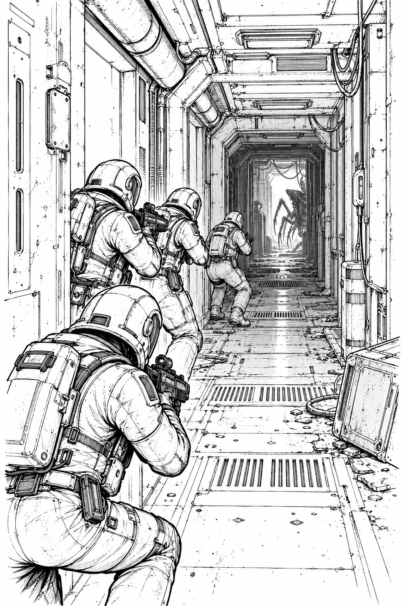

# Simple Hulk - RULES



Corridors. Contacts. Overwatch.

<!-- pagebreak -->

A two-player boarding game of narrow corridors, hidden bugs, and desperate
reaction fire. One player commands five Marines; the other commands the aliens.
Expect 75–120 minutes. This book has a cover and six rules pages. The companion
FLUFF book contains optional rules and eight further scenarios. Use the core rules
for your first expedition; add variants after a rematch.

## Rules page 1 of 6 — Get aboard

### What you need

- Two ordinary six-sided dice (d6), paper, pencil, and a square grid.
- Five Marine counters with arrows showing their facing.
- Alien counters, blip counters, door counters, and overwatch/jam markers.
- A roster to record wounds, ammunition, and hidden blip strengths.

One square holds one model or one blip. Walls are impassable. Models cannot move
through each other. All distances count squares; movement is orthogonal, never
diagonal. No measuring tape or miniatures are needed.

### Your boarding team

Each Marine has **4 action points (AP)** per round, **2 wounds**, and one assigned
weapon. Use two boarding rifles, one scattergun, one rotary cannon, and one flame
projector for your first game. Every Marine also
has a knife and two grenades: one fragmentation and one stun. Grenades occupy no
hand slots. Marines keep facing; aliens do not.

A basic alien has **6 AP**, **1 wound**, and claws. Each alien activates once per
round. An alien created by revealing a blip inherits its remaining AP instead of
receiving fresh AP. Wounds persist. Remove a model immediately at zero wounds.

### Round sequence

1. **Marine phase:** Clear all overwatch markers. Each surviving Marine activates
   once, in any order, spending up to 4 AP before the next Marine activates.
2. **Alien phase:** Receive mission reinforcements, then activate every alien and
   blip once, in any order. Finish one activation before starting another.
3. **End phase:** Remove stun markers, advance the round counter, and check the
   mission deadline. Overwatch remains set until the next Marine phase.

Unused AP disappear. You may stop an activation early. There are no shared action
points, free actions, or actions during another model's activation except the
specified overwatch reactions. The Marines take the first phase of round 1.

### Dice and damage

A ranged attack rolls the number of dice listed for its weapon. Each die meeting
its hit number inflicts one wound on its target. Excess wounds are lost. Unless
an attack explicitly affects an area, it has just one target. There are no armor
saves. Roll melee as described on rules page 2.

**First game:** Build the rules page 6 map, place the five Marines on `M` squares facing
north, and give the alien player four starting blips. Read rules pages 2–5, then begin.

<!-- pagebreak -->

## Rules page 2 of 6 — Movement, sight, and claws

### Actions

| Action | Marine AP | Alien/blip AP |
|---|---:|---:|
| Move one square forward or sideways, keeping facing | 1 | 1 |
| Move one square backward, keeping facing | 2 | 1 |
| Turn 90 degrees | 1 | Not needed |
| Open or close an adjacent door | 1 | 1 |
| Make one ranged attack | Weapon cost | — |
| Make one melee attack against an adjacent enemy | 1 | 1 |
| Throw a grenade | 2 | — |
| Enter overwatch | 2 | — |
| Clear a jam | 1 | — |
| Operate a mission console while standing on it | 2 | — |

An about-face takes two turns. All adjacency means orthogonal adjacency. You can
open or close a door from any square next to it, regardless of facing. An open
door is an ordinary floor square. A door cannot close while its square is
occupied. Closed doors block movement and sight. Doors cannot be attacked in
the basic rules.

### Facing and line of sight

A Marine can shoot or throw into its **front arc**: the forward half of the board,
including its sideways boundary. A target directly behind or behind-and-sideways
is outside that arc. For example, a north-facing Marine can target any square
in its own row or farther north, subject to range and clear sight.

Range is **Manhattan distance**: horizontal squares plus vertical squares between
shooter and target. Adjacent targets are range 1; the shooter's own square is 0.
Draw a straight line between square centers. Any intervening wall, closed door,
model, or blip blocks that line. If the line touches a wall corner, sight is
blocked; no shooting diagonally through a doorway's corner. If uncertain, treat
sight as blocked and use the same interpretation for both teams.

Marines see in **all directions**, with unlimited sight range, using those same
blocking rules. Facing limits shooting and throwing, not detection. Check blip
visibility after every action, including Marine movement and door opening.

### Melee

An attacker must be a model, not a blip. It attacks an orthogonally adjacent enemy;
Marines may attack in any direction. Both models roll one d6. A Marine adds **+0**; a basic alien adds **+2**. A rear attack gives the alien
another **+1** if it occupies the square directly behind the Marine.

The higher total inflicts one wound on the loser. A tie does nothing. The defender
may wound the attacker even though it is not activating. Each attack costs 1 AP,
so a surviving attacker can fight again. Neither model moves after a fight.

<!-- pagebreak -->

## Rules page 3 of 6 — Overwatch: hold that corridor

**Overwatch is the core rule.** It exchanges movement and initiative for repeated
reaction shots. A Marine pays **2 AP** to enter overwatch with an eligible, unjammed
weapon. Mark it immediately. Entering overwatch ends that Marine's activation,
even if it has AP left. It cannot turn or perform other actions while marked.
Reactions cost no AP and have no per-round limit, but ammunition still applies.

### Exactly when a reaction happens

During the alien phase, resolve each alien/blip action in this order:

1. Spend AP and finish movement, a door action, or another non-attack action.
   If it is a melee attack, spend its AP but **pause before rolling melee**.
2. Reveal newly visible blips using rules page 5.
3. Every overwatching Marine that can shoot the **acting alien** may fire once.
   Resolve eligible Marines in the Marine player's chosen order.
4. If the acting alien survives, finish its paused melee attack, if any. Continue
   its activation if it has AP left.

The target must be in range, in the Marine's front arc, and have clear line of
sight. No reaction occurs merely because a phase begins, a model stands still,
or reinforcements arrive. Spending AP to do nothing does not trigger a reaction.
An alien moving into an adjacent square can be shot before it spends a later AP
to attack. Declaring an attack while already adjacent also triggers a shot before
melee. A door-opening alien can be shot through the newly open doorway.

If the acting blip reveals, nominate one of its placed aliens as the **acting
alien** before any reaction. Other aliens placed by that reveal do not generate
shots just for appearing. They will generate reactions when they act. A Marine
may decline any reaction. If an earlier shot kills the acting alien, later
Marines cannot shoot a replacement target during that same reaction window.

### Jams

For each overwatch attack, roll the weapon's normal dice. **If any die is a 1,
the weapon jams and the entire attack inflicts no damage.** Mark the jam and
remove that Marine's overwatch marker. Ordinary shots never jam. An empty weapon cannot fire or enter overwatch.

A jammed Marine cannot shoot or enter overwatch until it spends 1 AP clearing
the jam during its next activation. Clearing costs no ammunition. Jams do not
prevent movement, melee, grenades, or console use. A jam does not change melee rolls.

### Example: three chances, one failure

An alien moves into a rifle's range and rolls no dice itself. The Marine reacts,
rolling 2 and 4: a miss. The alien moves again; the reaction rolls 3 and 5,
killing it. A second alien opens a door and draws another reaction: 1 and 6.
That shot deals no damage and jams the rifle. The second alien can advance safely
from that Marine until the gun is cleared and overwatch is set again.

<!-- pagebreak -->

## Rules page 4 of 6 — Four weapons, two grenades

Assign each Marine one weapon for the whole mission. All weapons have unlimited
ammunition except the rotary cannon and flame projector. Weapons cannot be
transferred. Ammunition is per attack, including failed or jammed attacks.

| Weapon | Attack AP | Range | Dice / hit | Overwatch? | Melee bonus |
|---|---:|---:|---|---|---:|
| Boarding rifle | 1 | 8 | 2d6 / 5+ | Yes | +0 |
| Scattergun | 1 | 4 | 3d6 / 5+ | Yes | +0 |
| Rotary cannon | 1 | 10 | 3d6 / 5+ | Yes | +0 |
| Flame projector | 2 | 4 | Special below | No | +0 |

**Boarding rifle:** Reliable reach with no additional rules.

**Scattergun:** At range 1–2, hits on 4+ instead of 5+. It still targets just one
alien; other models block its shot normally.

**Rotary cannon:** Starts with **8 ammunition marks**. Cross off one whenever an
attack is rolled. No reloads in the basic game. A jam on its last ammunition mark
leaves it empty.

**Flame projector:** Starts with **4 fuel marks**; each attack spends one. Choose
a visible floor square in the front arc within range. Roll one d6 for each model
on that square and each orthogonally adjacent floor square: on 3+, that model
suffers **2 wounds**. Walls and closed doors exclude their own squares; the
blast never crosses a closed door or wall to affect a neighboring square.
Friendly models can be hit. There is no lingering fire. Reveal blips in the area
before rolling; roll separately for every alien placed in affected squares.
Aliens placed outside the affected squares are not hit.

### Grenades

Each Marine starts with **one of each**. Cross off a grenade when thrown. Choose
a visible floor square in its front arc at range 1–4. Grenades automatically land
there; they cannot bounce around corners. Their affected area is the target and
its orthogonally adjacent floor squares, with the flame projector's wall/door
restriction. Reveal affected blips before applying effects. No overwatch occurs
in the Marine phase.

- **Fragmentation:** Roll one d6 per affected model. On 4+, inflict one wound.
  Friendly models can be wounded.
- **Stun:** Every affected model loses **2 AP during the upcoming alien phase**
  (minimum 0). Mark affected models; repeated stuns do not stack. Stunned aliens
  still defend in melee. A stunned Marine loses its overwatch marker immediately
  and cannot enter overwatch again this round. It keeps any remaining Marine AP.

If a stunned blip is revealed later, all its aliens inherit the stun. At the end
of the alien phase, remove all stun markers, even from models that never acted.

<!-- pagebreak -->

## Rules page 5 of 6 — Blips and alien deployment

### Hidden contacts

Make numbered blips and privately assign each a strength of **1, 2, or 3 aliens**.
Use the mission's blip pool. For the starting mission, prepare twelve numbered
blips: four strength-1, four strength-2, and four strength-3. Shuffle their
assignment, record it secretly, and use each blip once.
The Marine player sees only its number. Blips have 6 AP, move without facing,
operate doors, and block sight like models. They cannot attack or occupy an
objective to deny console use unless they physically block the square.

A blip must reveal as soon as any Marine has line of sight to it. The alien player
may also reveal one voluntarily at the start of that blip's activation, for no
AP. Reveal before trying to attack or before ending movement next to a Marine.
There are no empty blips in the basic game.

### Place the aliens

Remove the blip. Place the first alien on its square, then place the others on
empty orthogonally adjacent floor squares. Choose their positions, but do not
place through closed doors. If there is insufficient room, excess aliens are
lost. They cannot be held in reserve or placed farther away.

If the blip had not activated this phase, each revealed alien may activate later
this phase with its normal 6 AP. If it reveals during its activation, pick one
alien to continue immediately; **all** its aliens have only the blip's remaining
AP and the others activate later. If the blip had finished its activation, all
its aliens count as activated and wait until next round. Stun reduces the blip's
budget once; do not subtract it again from inherited remaining AP.

For a grenade or flame attack, placement happens before damage and follows these
same constraints. Models created during the Marine phase get their normal alien
phase activation, subject to stun. A blip directly visible to a Marine reveals
before it can be chosen as an ordinary ranged target.

### Starting blips and reinforcements

Follow the mission's starting contacts, arrival phases, and entry limits. A new
blip must use an empty entry square. If no legal entry is free, queue the arrival
until the next alien phase; place queued blips oldest first, within the mission's
per-phase arrival cap. New scheduled arrivals join the queue behind waiting ones.
Unused contacts expire after the mission's last permitted arrival phase.

An arrival in Marine sight reveals immediately but causes no overwatch shot
until an alien acts. Starting contacts also reveal if visible. There are no other
aliens or replenishment unless a mission says otherwise. Reveal the roster after
play. All core aliens use the basic profile; optional types are in FLUFF.

### Quick reference

Marines: 4 AP, 2 wounds. Aliens: 6 AP, 1 wound, melee +2. Move 1, door 1,
melee 1; Marine backward movement 2, turn 1, clear jam 1, grenade 2, console 2.
Overwatch costs 2 AP and ends activation. React after movement or door actions,
before attacks. Any reaction die of 1 cancels damage and jams the weapon.
Revealed aliens inherit remaining blip AP when revealed during an activation.

<!-- pagebreak -->

## Rules page 6 of 6 - Mission: Wake the beacon

Restore both relays, then transmit from the beacon. North is up. Each character
is one square: `.` floor, `=` closed door, `M` Marine start, `A`–`F` alien entries,
`U`/`V` relays, `X` beacon. `|`, `-`, and `+` outline hull walls and their corners;
blank cells are inaccessible space outside the passages. Walls and blanks block
movement and sight. Labels are floor; all seven doors start closed. The two digit
rows number columns; omitted trailing cells are blank.

```text
    0000000001111111111222222222233
    1234567890123456789012345678901
 1    +-+   +-+   +-+   +-+   +-+
 2   ++.++  |.|   |X|   |.|  ++.++
 3  ++...+--+.+---+.+---+.+--+...++
 4  |A.U.......................V.B|
 5  ++...+--+.+---+.+---+.+--+...++
 6   ++.++  |.|   |.|   |.|  ++.++
 7    |=|   |.|   |.|   |.|   |=|
 8    |.|  ++.++  |.|   |.|   |.|
 9  +-+.+--+...+--+.+---+.+---+.+-+
10  |F..........=................E|
11  +-+.+--+...+--+.+---+.+---+.+-+
12    |.|  ++.++  |.|   |.|   |.|
13    |.|   |=|   |.|   |=|   |.|
14    |.|   |.|   |.|  ++.++  |.|
15  +-+.+---+.+---+.+--+...+--+.+-+
16  |C......................=....D|
17  +-+.+---+.+---+.+--+...+--+.+-+
18    |.|   |.|   |.|  ++.++  |.|
19    |.|   |.|   |=|   |.|   |.|
20    |.|   |.|+--+.+--+|.|   |.|
21  +-+.+---+.++.......++.+---+.+-+
22  |.............................|
23  +-+.+---+.++.MMMMM.++.+---+.+-+
24    +-+   +-++-------++-+   +-+
25
```

### Setup and reinforcements

Place rifle, scattergun, cannon, flame projector, rifle on the five `M` squares,
left to right, facing north. All start fully supplied. Place four shuffled blips
on `A`, `B`, `C`, `D`. The twelve-blip pool is on rules page 5. Schedule two more
blips at each alien phase 2–5, using distinct empty entries `A`–`F`. The arrival
cap is two per phase, including queued contacts; discard the queue after phase 10.

### Objectives and deadline

A Marine standing on `U` or `V` spends 2 AP to restore that relay; mark it permanently.
After both are restored, a Marine on `X` spends 2 AP to transmit: immediate Marine
victory. Aliens win if all Marines die or transmission is unfinished at the end
of Marine phase **12**. Do not play alien phase 12 if the deadline ends the game.

### Example of a plan

The squad starts in the south chamber at row 23, columns 14–18. Split toward the
west and east relays at (4,4) and (4,28), while one rifle covers the central route
to `X` at (2,16). Every console costs 2 AP; reaching one with 1 AP left means waiting.
Opening the door at (19,16) costs 1 AP and can reveal contacts farther north.
The board has loops, so a held corridor does not seal every approach. All starts
and entries connect to all objectives through operable doors. Optional tile
patterns, bug types, and eight detailed missions are in [FLUFF.md](FLUFF.md).
